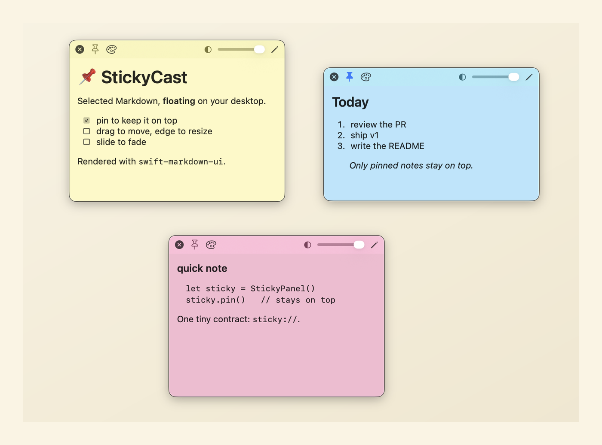

[English](README.md) | **한국어**

# StickyCast

MarkEdit에서 선택한 마크다운을 macOS 데스크탑에 **플로팅 스티커**로 띄우는 도구.



두 컴포넌트로 구성됩니다:

- **MarkEdit 확장**(`extension/`)은 에디터에서 선택한 마크다운을 `sticky://` URL 스킴으로 발사합니다.
- **컴패니언 앱 StickyCast**(`app/`)는 URL을 받아 데스크탑에 반투명 스티커 창으로 표시합니다(📌로 고정한 것만 항상 위).

두 컴포넌트는 커스텀 URL 스킴 하나(`sticky://`)로만 연결되는 느슨한 결합입니다.

## 요구사항

- **StickyCast 앱**: macOS 14 이상
- **MarkEdit**: [MarkEdit](https://github.com/MarkEdit-app/MarkEdit). Homebrew cask(`brew install --cask markedit`)는 현재 macOS 15 이상을 요구하므로, macOS 14에서는 [GitHub 릴리스](https://github.com/MarkEdit-app/MarkEdit/releases)에서 호환 버전을 직접 설치하세요.
- 빌드: Swift 5.9+ (Xcode 또는 CLI 툴체인), Node 18+

## 설치

> ⚠️ **앱을 먼저 실행하세요.** 컴패니언 앱이 실행되면서 `sticky://` URL 핸들러를 시스템에 등록합니다. 앱이 없으면 확장이 발사한 URL은 조용히 사라집니다.

### 1. 컴패니언 앱

```bash
cd app
./make-app.sh      # 빌드 → .app 조립 → Launch Services 등록 → 실행
```

`build/StickyCast.app`이 생성되고 실행됩니다. Dock에는 나타나지 않고(LSUIElement) 메뉴바에 `note.text` 아이콘으로 상주합니다.

### 2. MarkEdit 확장

> ⚠️ **먼저 MarkEdit을 설치하고 한 번 실행하세요.** MarkEdit이 처음 실행되면서 스크립트 컨테이너를 생성하며, Homebrew로 설치했다면 첫 실행 시 Gatekeeper 승인(“열기”)이 필요할 수 있습니다. 컨테이너가 없으면 아래 `deploy`가 명확한 오류 메시지를 남기고 중단됩니다.

```bash
cd extension
npm install
npm run deploy     # 빌드 후 MarkEdit scripts 디렉토리로 배포
```

MarkEdit을 재시작하면 **Extensions ▸ Pop as Sticky** 메뉴가 나타납니다.

## 사용

1. MarkEdit에서 마크다운 텍스트를 선택
2. **Extensions ▸ Pop as Sticky** 클릭
3. 선택 영역이 화면 우상단에 스티커로 뜹니다

스티커 상단 바에는 항상 📌(고정), ⋯(이동 손잡이), ✕(닫기)가, 하단에는 투명도 슬라이더가 보입니다(호버하면 진해집니다). 본문을 드래그해 이동하고 가장자리로 크기를 조절합니다.

- **핀 안 한 스티커**는 다른 앱으로 작업하면 뒤로 덮여 화면을 가리지 않습니다.
- **📌로 고정한 스티커**만 항상 맨 위에 떠 있어 작업 중에도 계속 보입니다.
- ✕(닫기)는 삭제입니다.

위치, 크기, 투명도, 고정 상태는 저장되어 앱을 재시작해도 복원됩니다.

메뉴바 아이콘에서 스티커 목록, **모두 숨기기/보이기**(한 번에 치웠다가 되띄우기, 삭제 아님), 모두 앞으로/모두 닫기, 최근 오류, StickyCast에 관하여, 종료를 이용할 수 있습니다.

## 제약 (v1)

- 뷰어 전용이라 스티커에서 편집이나 파일 저장 불가
- 스티커 최대 30장, 내용 크기 한도 약 1MB(원문 기준, 사실상 모든 마크다운 문서 커버). 초과 시 잘리지 않고 안내 후 거부
- 마크다운은 GFM 표준만 렌더

## 개발

```bash
cd app && swift test          # 코어 로직 단위 테스트 (파서, 스토어)
cd extension && npm test      # 인코딩 단위 테스트
```

## 라이선스와 크레딧

이 프로젝트는 [MIT 라이선스](LICENSE)로 배포됩니다.

- 마크다운 렌더링: [swift-markdown-ui](https://github.com/gonzalezreal/swift-markdown-ui) (MIT)
- MarkEdit API 타입: [MarkEdit-api](https://github.com/MarkEdit-app/MarkEdit-api)
